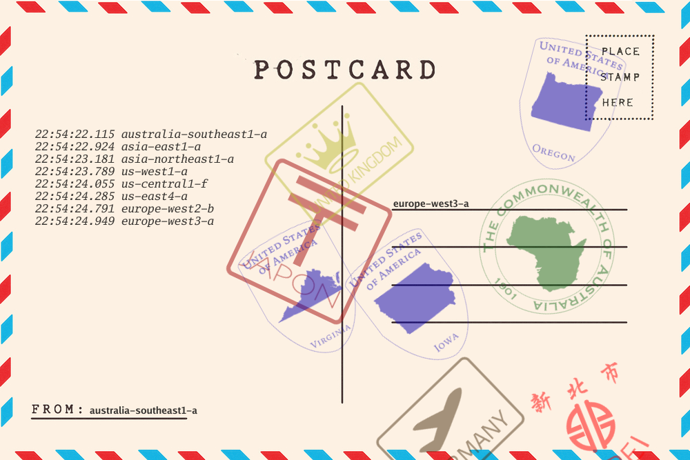

# GCPRelay
This is a demonstration of Google Cloud Compute Engine's network infrastructure.
It runs a webserver that receives messages in a specific format. The format 
includes a encoded png. At every stop along the way, another stamp png is 
composited onto the postcard. The stamp is specific to the location of the machine.

## Using the existing setup

### Requirements
* A touchscreen computer for visualizer
* A mobile device with camera for camera uploader
* An attached printer

#### Setup Visualizer
* Launch Chrome in [kiosk printing mode](https://stackoverflow.com/questions/31405988/run-silent-print-via-chrome-app-in-kiosk-mode) 
* Launch [http://v.gcprelay.net/](http://v.gcprelay.net/)

#### Setup Mobile Device
  * Launch [http://m.gcprelay.net/](http://m.gcprelay.net/)

## Setting up your own

### Customize Configuration 
* `cp Sample.properties Makefile.properties`
* Edit to reflect your project settings. 
* Edit infrastructure/scripts/.list to include any zones you may need. 

### Build Executable
* `cd infrastructure`
* `make gcprelay`

### Build Infrastructure
* `cd infrastructure`
* `make create`

### Deploy frontend
* `cd frontend`
* `make deploy`

### Enable APIs
* In GCP Project, go to API & Services
* Click "Enable APIs and Services"
* Search for "Firestore"
* Click on "Google Cloud Firestore API"
* Enable it. 

### Add New Zone
If later on you want to add new zones to the mix, you can pretty easily. 
* `cd infrastructure`
* `make create [zone name]`
* add zone name to infrastructure/scripts/.list
* Create new stamp for zone - 200 x 200 png
* Put new stamp in assets/img/
* Tweak frontend/css/main.css to position new zone correctly.
* Add city to /route/route.go Function order
* `cd infrastructure`
* `make update`

### Update Stamp
If later on you want to change a stamp:
* Create a 200px x 200px png with a transparent background (I use illustrator for this, but to each their own.)
* Copy image to /assets/img
* Name for the correct region
* `cd /infrastructure/`
* run `make update.images`

## FAQ
<dl>
    <dt>Why is the build (bash scripts + Makefile) system so convoluted?</dt>
    <dd>Cause it was the simplest complex solution that could handle 
        <ul>
            <li>Looping through list of zone/machines</li>
            <li>Being able to run operations on one or all nodes </li>
            <li>Being able to run in parallel</li>
        </ul>
    </dd>
    <dt>Why isn't it GRPC?</dt>
    <dd>I gave it a shot, but it ended up not being appreciably faster than HTTP in this circumstance.</dd>
    <dt>Why does the picture appear to backtrack sometimes?</dt>
    <dd>Cause the image is driven by Firestore, and sometimes it can take less 
    time for the image to travel around our network than it does to complete an 
    earlier Firestore write. (Actually kinda cool)</dd>
</dl>    

